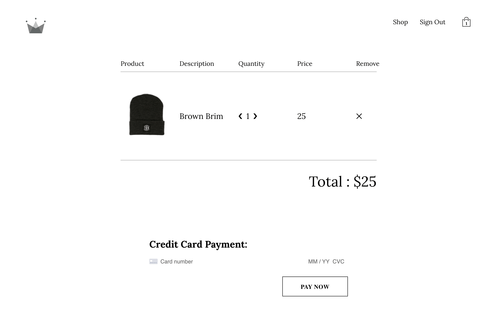

# Crown Clothing

Crown Clothing is an online clothing store web application developed using React and Firebase. The application offers a seamless shopping experience with features such as user authentication (including Google authentication via Firebase), product browsing by category, adding products to the cart, and secure checkout powered by the Stripe API.


## Features

- **User Authentication:**
  - Secure user registration and login powered by Firebase Authentication.
  - Google authentication is supported for a hassle-free login experience.


- **Product Categories:**
  - Explore a wide range of clothing products categorized by types such as men, women, and accessories.


- **Shopping Cart:**
  - Conveniently add desired clothing items to the shopping cart.


- **Stripe Checkout:**
  - Enjoy a secure and streamlined checkout process with the integration of the Stripe API.

## Tech Stack

- **Frontend:**
  - React

- **Authentication:**
  - Firebase Authentication (Google Auth)

- **Database:**
  - Firebase Firestore

- **Payment Processing:**
  - Stripe API

## Getting Started

1. Clone the repository.
2. Install dependencies using `npm install`.
3. Set up a Firebase project and configure the Firebase credentials in the `.env` file.
4. Set up a Stripe account and configure the Stripe API keys.
5. Deploy the app to your preferred hosting platform.
6. Ensure that the necessary Firebase and Stripe configurations are set up.

```bash
# Install Dependencies
npm install

# Run the App Locally
npm start
